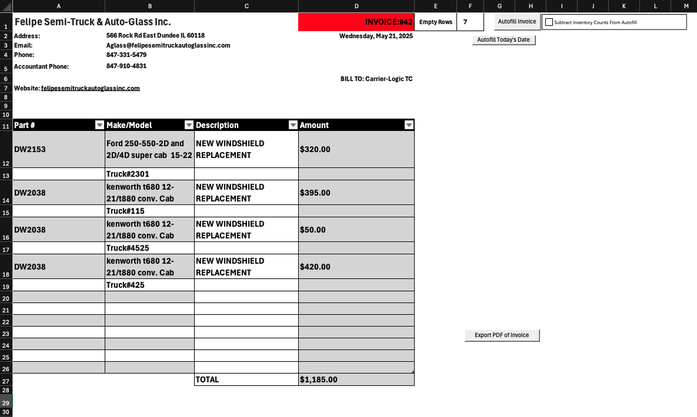
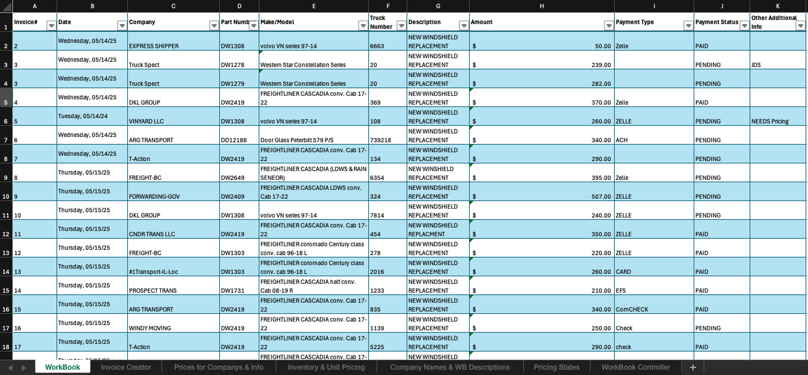
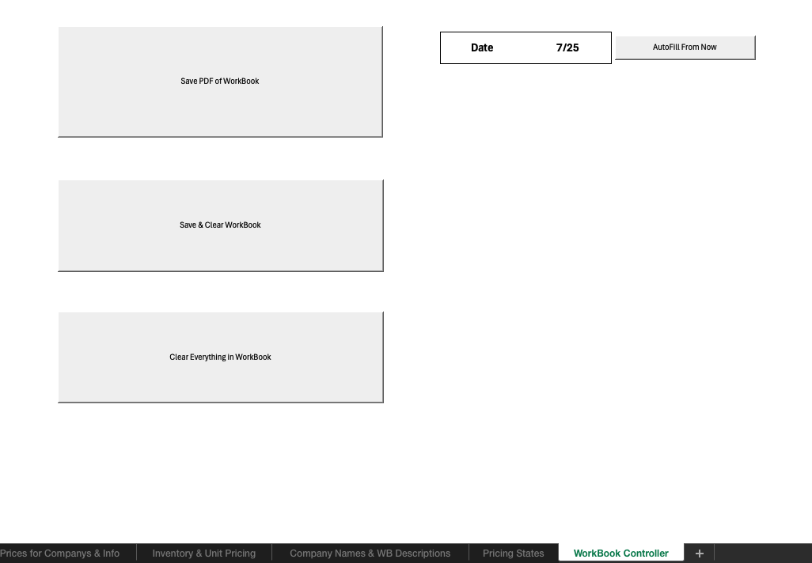

# VBA-Excel-AutoGlass-Invoice-System

This is a public version of a project requested by a client for a simple invoicing software able to handle inventory management, invoice creation, and different priming's for clients needs and use cases. Created to be highly adjustable, easy to use and navigate, and be contained inside excel. Powered using VBA, formulas, and the full suite of excel developer tools to make as streamlined experience for client as possible. Puting Usability first.

## Capabilities

Able to automatically handle varied pricing per client, defaults provided for values, features for reducing typing like instead of retyping standard entrys like company names, dropdowns are available. Controls for various things around the file like workbook controls, invoice controls, and more.

**All Pricing info is placeholder data, all involved clients privacy is respected
